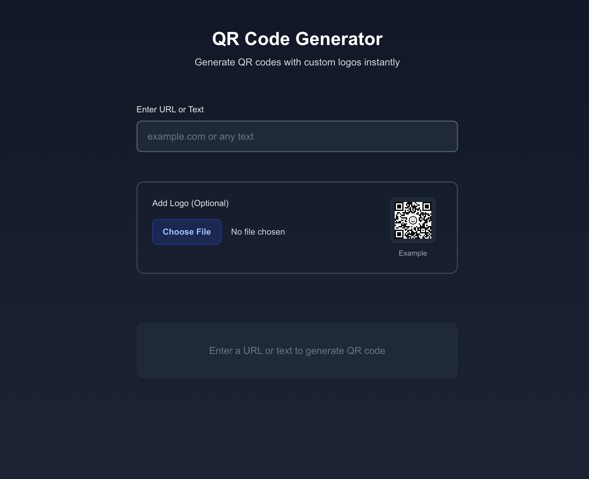

# QR Code Generator

A modern, user-friendly QR code generator built with Next.js 15, TypeScript, and TailwindCSS. Create customizable QR codes with optional logo integration.



## 🌐 Live Demo

Visit the live application: [freeqrcode.vercel.app](https://freeqrcode.vercel.app)

## ✨ Features

- **Instant QR Code Generation**: Real-time QR code creation as you type
- **Custom Logo Support**: Add your own logo to the center of the QR code
- **Logo Size Control**: Adjust logo size while maintaining QR code readability
- **Dark Mode Support**: Seamless experience in both light and dark themes
- **Responsive Design**: Works perfectly on desktop and mobile devices
- **Download Option**: Export your QR code as a PNG file
- **Accessibility**: Built with ARIA labels and keyboard navigation support

## 🛠️ Built With

- [Next.js 15](https://nextjs.org/) - React Framework
- [TypeScript](https://www.typescriptlang.org/) - Type Safety
- [TailwindCSS](https://tailwindcss.com/) - Styling
- [QRCode.react](https://www.npmjs.com/package/qrcode.react) - QR Code Generation

## 🚀 Getting Started

1. Clone the repository:

```bash
git clone https://github.com/yourusername/qrcodegenerator.git
```

2. Install dependencies:

```bash
cd qrcodegenerator
npm install
```

3. Run the development server:

```bash
npm run dev
```

4. Open [http://localhost:3000](http://localhost:3000) in your browser

## 💡 Usage

1. Enter any URL or text in the input field
2. (Optional) Add a logo by clicking the file upload button
3. Adjust the logo size if needed
4. Download your QR code by clicking the download button

## 📱 Mobile Support

The application is fully responsive and works on all device sizes:

- Desktop browsers
- Tablet devices
- Mobile phones

## 🌙 Dark Mode

The application automatically detects your system's theme preference and adjusts accordingly. You can also manually toggle between light and dark modes.

## 🔒 Security

- No data is stored on servers
- All QR code generation happens client-side
- Secure file handling for logo uploads

## ⚖️ License

This project is licensed under the MIT License - see the [LICENSE](LICENSE) file for details
